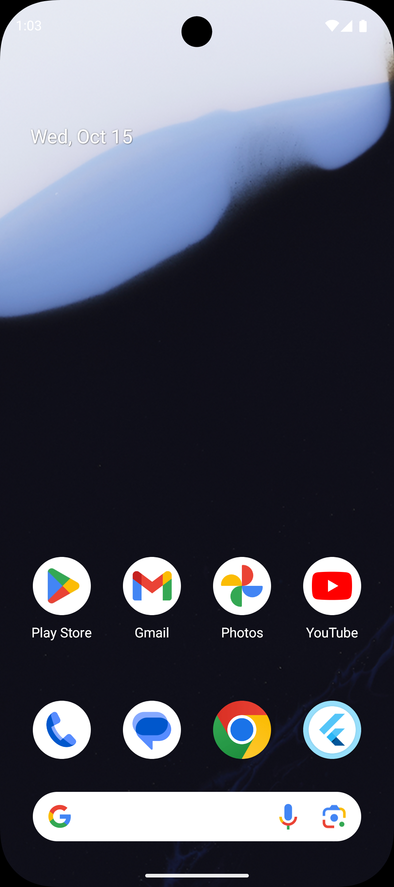
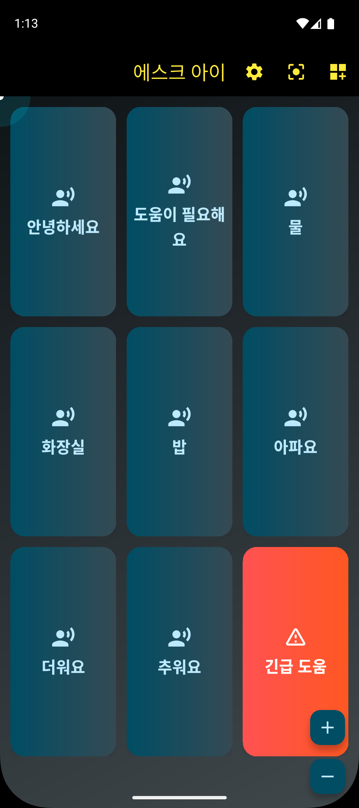
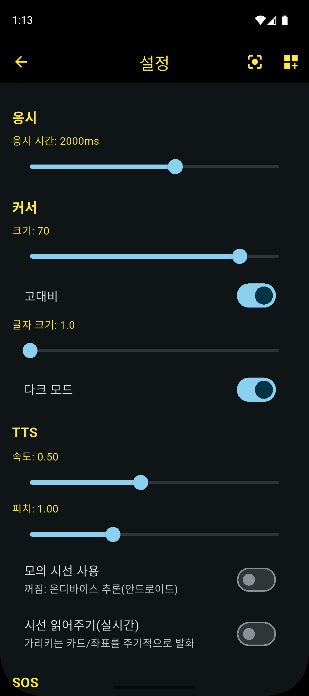
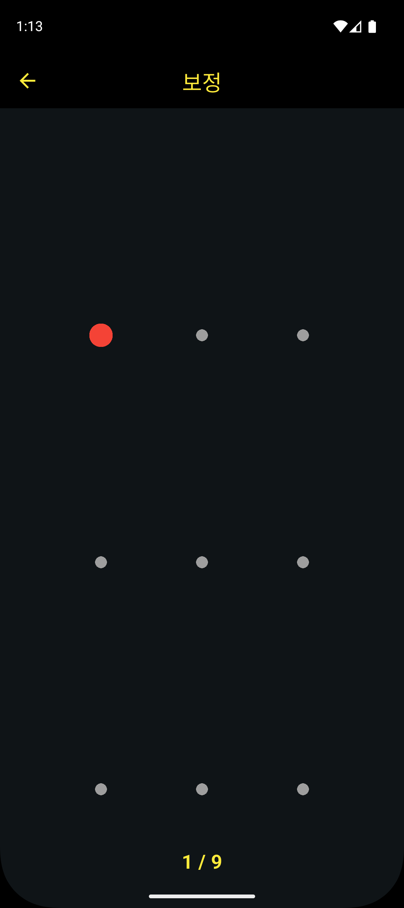

# Ask Eye (gaze_tts_app)

전면 카메라의 **시선 추정(Gaze Tracking)** 을 활용해 버튼을 응시하여 문장을 발화(TTS)하거나  
긴급(SOS) 동작을 수행하는 **접근성 보조 앱**입니다.  
웹/권한 거부/에뮬레이터 환경에서는 터치 제스처로 **시선을 모의 입력(Mock)** 할 수 있습니다.

<p align="center">
  
  <br/>
  
  
</p>

---

## 📑 목차
- [개발 동기](#-개발-동기)
- [핵심 기능](#-핵심-기능)
- [기술 스택](#-기술-스택)
- [개발 환경](#-개발-환경)
- [프로젝트 구조](#-프로젝트-구조)
- [설치 및 실행](#-설치-및-실행)
- [권한 및 플랫폼 동작](#-권한-및-플랫폼-동작)
- [사용 방법](#-사용-방법)
- [테스트 및 빌드](#-테스트-및-빌드)
- [Gitignore 참고](#-gitignore-참고)

---

## 개발 동기
청각·언어 장애로 인해 발성이 어렵거나 손 사용이 제한된 사용자가  
시선만으로 빠르고 직관적인 의사 표현을 할 수 있도록 설계되었습니다.

- 반복되는 일상 표현(물·화장실·도움 요청 등)을 빠르게 전달 → **반응 시간 단축 / 피로도 감소**  
- 보호자 부재 상황에서도 **기본적 의사 표현 및 긴급 호출(SOS)** 가능 → **안전성 향상**  
- 개인 맞춤 보드 구성 가능 → **학습 및 재활 환경에 적응**  

모든 데이터는 **온디바이스(on-device)** 추론으로 처리하며,  
권한이 없거나 미지원 플랫폼에서는 **Mock Gaze** 로 자동 전환됩니다.

---

## 핵심 기능
| 분류 | 설명 |
|------|------|
| **시선 추정** | Google ML Kit 얼굴 검출 기반 시선 포인트 계산 (안드로이드) |
| **모의 시선(Mock)** | 권한 거부·웹·데스크톱 환경에서 터치로 시선 대체 |
| **보정(Calibration)** | 3×3 타깃 응시로 원시 좌표 → 화면 좌표 변환 행렬 생성 |
| **응시 선택(Dwell)** | 일정 시간 응시 시 카드 트리거 (링, 진동, 플래시 피드백) |
| **TTS 발화** | 언어/속도/피치 설정 가능, 실시간 읽어주기 옵션 포함 |
| **SOS 기능** | 112/119/사용자 번호로 통화·문자 발송, 진동+TTS 안내 |
| **보드 편집기** | 카드 추가/삭제/수정 및 JSON 저장 |
| **접근성 옵션** | 고대비·폰트 스케일·다크모드·큰 터치 타깃·시각 피드백 |
| **로그 저장** | `sqflite` 기반 동작 로그, CSV 내보내기 가능 |

---

## 기술 스택
- **Framework**: Flutter (Dart, Material 3)
- **ML / Camera**: `google_mlkit_face_detection`, `camera`
- **TTS / Vibration**: `flutter_tts`, `vibration`
- **Device / Permissions**: `url_launcher`, `permission_handler`
- **Storage / DB**: `shared_preferences`, `sqflite`
- **Localization**: `intl`
- **UI Theme / State**: 커스텀 다크모드 + 접근성 테마

---

## 개발 환경
- **IDE**: Visual Studio Code / Android Studio  
- **Flutter SDK**: 3.x 이상  
- **테스트 기기**: Pixel 9 (Android 15 Emulator)

---

## 프로젝트 구조
```plaintext
final/
├─ lib/
│  ├─ main.dart                 # 엔트리, AppRoot 구동
│  ├─ app.dart                  # 부트스트랩(TTS/DB/권한), 라우팅/테마
│  ├─ core/                     # 테마/로깅/접근성
│  ├─ data/                     # prefs / DB / storage
│  ├─ domain/
│  │  ├─ gaze/                  # 시선 FSM, 보정, Mock, Repo
│  │  ├─ tts/                   # TTS 서비스
│  │  ├─ sos/                   # SOS 서비스
│  │  └─ models/                # Card / Board / Settings 모델
│  ├─ platform/                 # Android 채널 기반 Gaze (Stub 포함)
│  └─ ui/
│     ├─ screens/               # 메인 / 설정 / 보정 / SOS / 편집 화면
│     └─ widgets/               # 커서, 카드 그리드, 진행 링 등
├─ assets/
│  └─ boards/cards_default.json # 기본 보드 템플릿
├─ l10n/                        # 언어 리소스(ko/en)
├─ pubspec.yaml
└─ .gitignore
```

---

## 설치 및 실행

### 의존성 설치
```bash
flutter pub get
```

### 실행
```bash
# Android (권장)
flutter run -d android

# iOS
flutter run -d ios

# Web (Mock Gaze 사용)
flutter run -d chrome
```

### 빌드
```bash
flutter build apk   # 또는 ios / web / windows / macos
```

---

## 권한 및 플랫폼 동작
| 플랫폼 | 동작 방식 |
|--------|------------|
| **Android** | ML Kit + Camera 이미지 스트림으로 on-device 시선 추정 |
| **iOS** | ML Kit Face Detection 지원 (권한 필요) |
| **Web / 데스크톱 / 권한 거부** | 5초 내 이벤트 없을 시 Mock Gaze 자동 전환 |
| **프리뷰 처리** | `GazeHiddenPreview`로 1×1 오프스크린 렌더링 |

권한 요청: **카메라 / 전화 / 진동**  
(`permission_handler` 패키지로 런타임 요청)

---

## 사용 방법

### 첫 실행
- 카메라 및 전화 권한을 허용  
- 거부 시 Mock Gaze 자동 활성화 (음성 안내)

### 보정(Calibration)
- 3×3 점을 순차 응시 → 보정 행렬 자동 계산 후 저장

### 메인 화면
- 시선 커서가 카드에 머물면 진행 링이 차오르고  
  완료 시 TTS 발화 및 피드백 제공

### SOS 모드
- 112/119/사용자 지정 버튼 응시 시  
  진동 + 음성 안내 후 통화 또는 문자 전송 시도

### 설정 화면
- 응시 시간, 커서 크기, 고대비, 글자 크기,  
  TTS 속도/피치, Mock Gaze 여부, 실시간 읽어주기 등 설정

### 보드 편집기
- 카드 추가/수정/삭제 가능  
- `SharedPreferences` 에 JSON 형태로 저장됨

---

## 테스트 및 빌드
```bash
flutter test        # 단위/위젯 테스트
dart format .       # 코드 포맷 정리
flutter analyze     # 린트 검사
```

> 테스트 템플릿은 현재 구조(AppRoot)에 맞게 보완 필요  
> 공식 lints(`flutter_lints`) 적용 중

---

## Gitignore 참고
Flutter 표준 `.gitignore` 기반:
- `/build/`, `.dart_tool/`, `.pub-cache/`, `.idea/`, `.DS_Store`  
- 플랫폼 빌드 산출물, IDE 메타, 임시 파일 등 제외  
- 외부 API 키/비밀 정보 없음 (필요 시 `.gitignore`에 추가)

---

<p align="center">
  <sub>© 2025 NanoLab-Vibe-Coding — Ask Eye Flutter Project</sub>
</p>
